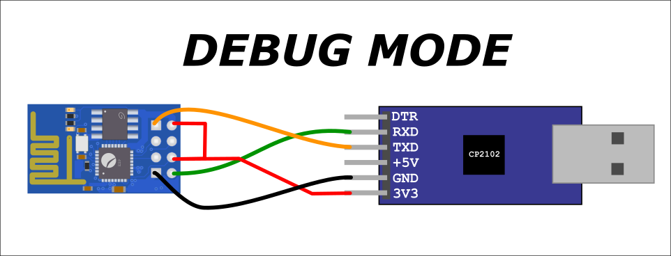

# Bear market ticker

## _A ticker for ants?_

ESP8266 based Bitcoin ([and many other cryptocurrencies](https://www.bitstamp.net/api/#ticker)) ticker.

## Hardware requirements

- 1 x [ESP-01 module](https://www.ebay.com/itm/384230826303)
- 1 x [CP2102 USB TTL](https://www.ebay.com/itm/284317008939) - Actually you can use any kind of USB-TTL converters
- 1 x [AMS1117 voltage regulator](https://www.ebay.com/itm/114900248696) - Or any other 3.3v voltage regulator
- 1 x [0.91" OLED LCD display](https://www.ebay.com/itm/284373421980) - Or any other i2c OLED display

## Software requirements

- Arduino
- [ESP8266 Arduino core](https://github.com/esp8266/Arduino)
- [ArduinoJson library](https://arduinojson.org/) - Install it using the library manager
- [Adafruit_SSD1306 library](https://github.com/adafruit/Adafruit_SSD1306) - Install it using the library manager

## Programming the ESP-01


Programming the ESP-01 is not **that** straightforward as many other boards. The ESP-01 needs its `GPIO-0` pin put low before power up to enter in flash mode.


This way the ESP-01 can be programmed from the Arduino IDE. Don't forget to set the board to "Generic ESP8266 module" and the serial port pointing to your USB TTL device. Take into account that as long as `GPIO-0` is kept in a low level the ESP-01 will remain in flash mode, so the software you burnt into it wouldn't run, unless you left `GPIO-0` floating.

### Setting up the WiFi connection

The ESP-01 has a WiFi transceiver embedded. Configure your wifi network name and password:

```c
const char* ssid     = "your-wifi-ssid";
const char* password = "your-wifi-password";
```

and you'll be good to go!

### Setting up other currencies

Take a look to the [Bitstamp ticker api](https://www.bitstamp.net/api/#ticker), choose a ticker pair and set it up on `bitstamp_uri`.

```c
const String bitstamp_uri = "/api/v2/ticker/btcusd/";
```

## Debugging the ticker

Once you programmed the code [bear-market-ticker.ino](bear-market-ticker.ino) into the ESP-01, remove the `GND` connection to `GPIO-0`, remove power and apply power again. Now if you open a serial console, you'll get the BTCUSD pair price.



## Running the ticker

The OLED display is connected to the ESP-01 using an i2c connection, hence `SDA` and `SCL` signals are routed through `GPIO-2` and `GPIO-0`. There's also an AMS1117 voltage regulator, hence you can power up the entire board using any USB charger.


## Finished ticker pictures


